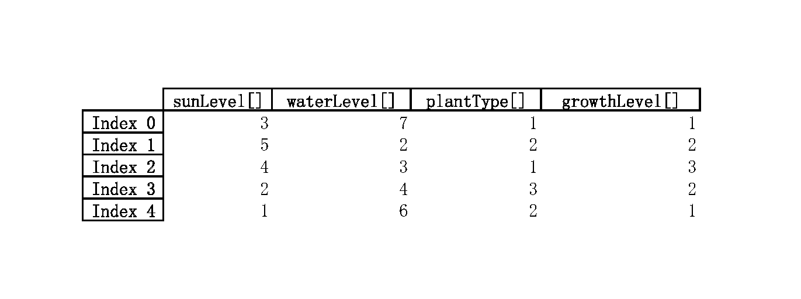

# Devlog Entry - [12/08/2024]

## How we satisfied the software requirements

### F0+F1+F2

There is a change made that to reduce the amount of bugs that had on the game where more of the function will be working correctly for the game to play.

### Internationalization

So in order to change the strings in the program that it is shown we made it a language folder and storing all the words and giving them name for different language, and back to the code the string will be change to calling those things from the word folder for it to showing other different language beside to be hard coded and hard to change. The file in the main and index html get changed a lot in order to be capable of changing the language for the player to choose what localization they want for the game.

### Localization

This game supports English, Spanish, Chinese and Arabic. For each of the languages, we translate by someone who knows the translation and if we don't know, we use a translator to help us in this process. So for the translation tools that we input our original sentence into and make it out to another language. The player can choose the language on the head of the page. The game is one version that is capable of running three languages, it is not hard coded. There is an option for players to choose any language during any time playing meaning they can change in the middle of playing.

### Mobile Installation

The mobile installation is still in progress as we make it possible for our game to function 100% percent for the mobile. like by clicking the key in the PC we will change it to clicking it as there is no keyboard for most mobile devices.

### Mobile Play (Offline)

Our game for it to play well on mobile devices. Changes aren’t a lot needed to be made in the future as we want to implement it offline as this game is set to be played locally.

## Reflection

Our team plans to focus more on making the language model for this project the mobile is lining after it. And as working around that a lot of our roles change a lot to work on everything possible, Now we are thinking of gathering feedback from the player and feed them back base of the result. So we can learn from it.

# Devlog Entry - [12/02/2024]

## How we satisfied the F1 software requirements

1. [F1.a]: We used a Structure-of-Arrays (SoA) format to store the state of the game grid. Each grid cell property (e.g., sun level, water level, plant type, growth level) is stored as a separate contiguous array. This ensures efficient memory access patterns when updating or querying specific properties across all grid cells. Below is a diagram illustrating our memory allocation strategy: 
2. [F1.b]: We implemented a save/load system using JSON serialization for the game state. Players can manage multiple save slots, each represented by a unique file, allowing them to save progress and load it later. Press "1" to save the current game and "2" to load the save slot.
3. [F3.c]: An auto-save is triggered automatically at the end of every turn, storing the game state in a dedicated auto-save file. When the game is launched, it checks for the presence of an auto-save file and prompts the player to continue from the last session.
4. [F1.d]: We implemented an undo/redo system using a stack. Each turn's state is pushed onto the stack, allowing the player to undo actions. A separate stack tracks redo operations, letting players undo updos to revisit choices. Press "U" to undo and "D" to reoo.

## Reflection

These changes also influenced our UI design. We added indicators for save states and a history bar to visualize undo/redo actions. This evolution in design highlights our focus on player feedback and engagement.

# Devlog Entry - [11/28/2024]

## How we satisfied the F0 software requirements

1. [F0.a]: Our game features a central character, the Farmer, who navigates a 2D
   grid representing farmland. Movement is implemented using keyboard input,
   allowing the player to move the character up, down, left, and right between
   grid cells. The grid layout is clearly defined with visible boundaries,
   ensuring the player stays within the playing area. This direct control over
   the character aligns with the requirement of navigating a 2D grid and forms
   the basis for engaging with the core mechanics of planting and harvesting.
2. [F0.b]: Time progression in our game is turn-based and requires manual input
   from the player. Each turn is triggered by hitting "Enter," ensuring the
   player has complete control over when to advance the simulation. Use arrow
   keys to move, "S" to plant (sow), and "R" to reap. During each turn, game
   elements like plant growth, water/moisture accumulation, and sun level
   adjustments are calculated and updated, giving the player a clear sense of
   time progression and allowing strategic decision-making at their own pace.
3. [F0.c]: The Farmer can interact with grid cells to sow or reap plants, but
   only when adjacent to the targeted cell. This proximity requirement ensures
   that actions feel deliberate and spatially grounded. Attempting to interact
   with a non-adjacent cell results in no effect, providing clear feedback to
   the player. This mechanic emphasizes strategic positioning and planning as
   the player navigates the grid to manage their farm.
4. [F0.d]: Each grid cell in the game tracks its sun and water levels, which are
   visually represented to the player for clarity. At the start of every turn,
   each cell's incoming sun and water are generated using a randomization
   function within predefined limits, simulating natural variability. Sun energy
   is consumed immediately during plant growth calculations. At the same time,
   water moisture accumulates over turns, adding a layer of strategy as players
   must account for varying resource levels across the grid.
5. [F0.e]: Plants in the game belong to one of three distinct species, each with
   unique growth characteristics. Growth is represented in discrete levels
   (e.g., Level 1, Level 2, Level 3), with visual and statistical differences
   that reflect progression. Players can identify each plant's type and growth
   level at a glance, which aids in planning their actions and achieving growth
   objectives.
6. [F0.f]: Plant growth is governed by straightforward spatial rules that depend
   on the sun and water levels of the cells they occupy and the presence of
   neighboring plants. For example, a plant may require a certain minimum water
   level and proximity to another plant of the same type to advance to the next
   growth stage. These rules introduce strategic depth, encouraging players to
   consider the placement and interactions of plants to optimize their growth.
7. [F0.g]: For this, we haven't put rules in the game yet, but ideally, a play
   scenario in the game is completed when the player meets a predefined victory
   condition, such as growing at least a specific number of plants to a certain
   level (e.g., "5 plants at Level 3"). This condition is communicated to the
   player at the start of the scenario, providing a clear goal to strive toward.
   Completing the condition ends the scenario, and the player is shown a
   performance summary.

## Reflection

Our plan changed from using Unity. After reading the software requirements, our
engine lead decided that Unity would be unnecessary for a project like this and
much simpler if we used typescript and HTML like we have been doing in class. We
took no creative approach and decided to stick with a barebones design that
worked. It works as expected, and we might add more later.

# Devlog Entry - [11/15/2024]

## Introducing the team

1. Tools Lead: Qihe Wang (@qwang122)
2. Assistant Tools Lead: Shaoan Wang (@shawn-sw)
3. Engine Lead: Brian Jin (@amphy0)
4. Assistant Engine Lead: Bolan Guan (@chargeling)
5. Creative Lead: Guangyang Chen (@BlankC6874)

## Tools and materials

1. We will be using Unity 2022.3.49f1. We chose Unity because of its familiarity
   with our Engine Lead and since it can make a game in both 2D and 3D using
   Unity, we can be flexible with what we choose to create. On top of that, it
   has a robust asset store and extensive documentation, allowing us to access
   more resources and support. We can aim to create a more polished product
   using integrated systems like physics and animation.
2. The programming language we will use is C# since that is what Unity expects.
3. Our project will use Visual Studio as our primary IDE for coding due to its
   robust debugging tools, Unity integration, and the team's familiarity with
   it, as we've been using it since we first learned programming. For visual
   assets, we will rely on Photoshop for its versatility in creating
   high-quality textures and UI elements. At the same time, Aseprite will be
   used for pixel art adjustments and animations due to its lightweight design
   and specialization in sprite editing. The project will primarily be developed
   using Unity 2023, which was strongly recommended by our Engine Lead, Brian,
   given his experience with the engine, ensuring we can efficiently address any
   challenges while leveraging Unity's powerful features.
4. Our alternate platform choice is still Unity, but instead of focusing on a
   traditional PC or console game, we will explore deploying the project as a
   mobile game. This approach will allow us to experiment with Unity's mobile
   optimization features, such as touch input integration and performance
   scaling for smaller devices. We will adapt our user interface and gameplay
   mechanics by targeting mobile to fit different audiences and platform
   requirements. This alternate focus helps us expand our understanding of
   Unity's versatility while creating a version of the game that reaches a
   broader audience.

## Outlook

Most teams want to make some easy games, but we will make a game that is easy
but fun for everyone who plays it. The coding part will be challenging because
we must code in a new language: C#. We hope we will survive that! (and we will.)
We will socialize more with each other and learn how to manage unity well!
